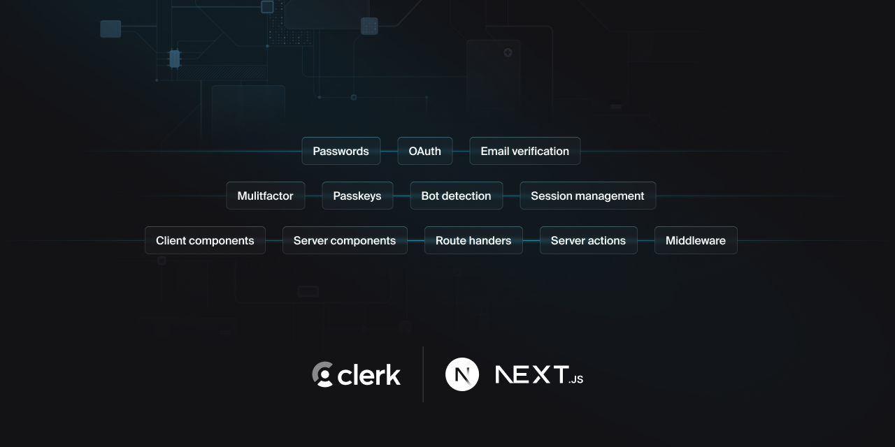

<p align="center">
  <a href="https://go.clerk.com/e3UDpP4" target="blank" rel="noopener noreferrer">
   <picture>
      <source media="(prefers-color-scheme: dark)" srcset="./public/light-logo.png">
      
    </picture>
  </a>
  <br />
</p>
<div align="center">
  <h1>
    Next.js Clerk + Supabase Starter Template
  </h1>
  <a href="https://www.npmjs.com/package/@clerk/clerk-js">
    
  </a>
  <a href="https://discord.com/invite/b5rXHjAg7A">
    
  </a>
  <a href="https://twitter.com/clerkdev">
    
  </a>
  <br />
  <br />
  
</div>

## Introduction

This template combines Clerk's developer-first authentication with Supabase's powerful database capabilities. Clerk provides pre-built React components and hooks for sign-in, sign-up, user profile, and organization management, while Supabase offers a scalable PostgreSQL database with real-time capabilities and built-in security.

This template allows you to get started with Clerk and Supabase in Next.js (App Router) in minutes, demonstrating features such as:

- Fully functional auth flow with sign-in, sign-up, and protected pages using Clerk
- Customized Clerk components with Tailwind CSS
- Hooks for accessing user data and authentication state
- Organizations for multi-tenant applications
- Supabase database integration with real-time capabilities
- Row Level Security (RLS) policies with Clerk user authentication
- Type-safe database queries with generated types
- Real-time subscriptions and live updates

## Demo

A hosted demo of this example is available at https://clerk-nextjs-app-router.vercel.app/

## Deploy

Easily deploy the template to Vercel with the button below. You will need to set the required environment variables for both Clerk and Supabase in the Vercel dashboard.

[](https://vercel.com/new/clone?repository-url=https%3A%2F%2Fgithub.com%2Fclerk%2Fnextjs-auth-starter-template&env=CLERK_SECRET_KEY,NEXT_PUBLIC_CLERK_PUBLISHABLE_KEY,NEXT_PUBLIC_SUPABASE_URL,NEXT_PUBLIC_SUPABASE_ANON_KEY&envDescription=API%20keys%20needed%20for%20authentication%20and%20database%20access&envLink=https%3A%2F%2Fgithub.com%2Fclerk%2Fnextjs-auth-starter-template%3Ftab%3Dreadme-ov-file%23running-the-template&demo-url=https%3A%2F%2Fnextjs-auth-starter-template-kit.vercel.app%2F)

## Running the template

```bash
git clone https://github.com/clerk/clerk-nextjs-demo-app-router
```

To run the example locally, you need to:

1. Sign up for a Clerk account at [https://clerk.com](https://go.clerk.com/31bREJU)
2. Create a new project in the [Clerk Dashboard](https://go.clerk.com/4I5LXFj)
3. Create a new project in [Supabase](https://supabase.com)
4. Set up the required environment variables:
   - Copy `.env.example` to `.env.local`
   - Add your Clerk API keys from the Clerk Dashboard
   - Add your Supabase URL and anon key from your Supabase project settings
5. Enable Organizations in your Clerk Dashboard's "Organization Settings"
6. Set up your database schema in Supabase:
   - Use the SQL editor or Table Editor to create your tables
   - Configure Row Level Security policies
7. Install the required dependencies with `npm install`
8. Start the development server with `npm run dev`

## Learn more

To learn more about Clerk, Supabase, and Next.js, check out the following resources:

- [Quickstart: Get started with Next.js and Clerk](https://go.clerk.com/vgWhQ7B)
- [Clerk Documentation](https://go.clerk.com/aNiTioa)
- [Supabase Documentation](https://supabase.com/docs)
- [Supabase Client Library Reference](https://supabase.com/docs/reference/javascript/introduction)
- [Next.js Documentation](https://nextjs.org/docs)

## Found an issue or have feedback?

If you have found an issue with this repo or have feedback, please join our Discord and create a new thread inside of our [support](https://clerk.com/discord) channel.

## Connect with us

You can discuss ideas, ask questions, and meet others from the community in our [Discord](https://clerk.com/discord).

If you prefer, you can also find support through our [Twitter](https://twitter.com/ClerkDev), or you can [email](mailto:support@clerk.dev) us!
